Documentacion de Docker
Johan Alexander Acero Salazar
3145555

Con un formato de docker compose, hize el primer punto que es meter las cuatro bases de datos dentro de docker, cada una corriendo en su propio contenedor independiente.

Indica la version del formato docker compose: 

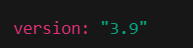

Aqui creamos el contenedor de MySQL, usamos la imagen oficial de MySQL, creamos un usuario, contraseña y puerto con la cual vamos a poder acceder a ese contenedor desde el motor de base de datos:

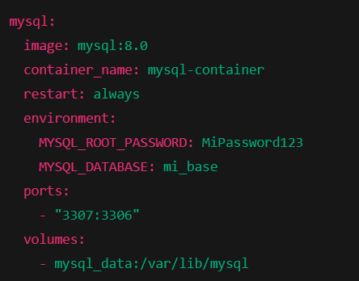

Levantamos el contenedor de SQL Server 2022, definimos la contraseña del usuario administrador "sa" con la contraseña "MiPassword123!", el puerto interno 1433 accesible desde el motor de base de datos:

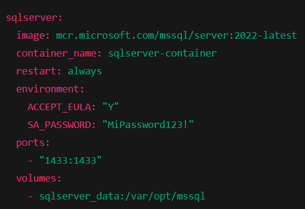

Creamos el contenedor de PostgreSQL 15 con usuario, contraseña y puerto 5432 (interno) expuesto en 5433 (host) con volumen para que no se borren los datos:

Creaamos un contenedor de MongoDB 7 con usuario administrador (admin) con su contraseña, en el puerto 27017 (interno) en 28017 (externo):
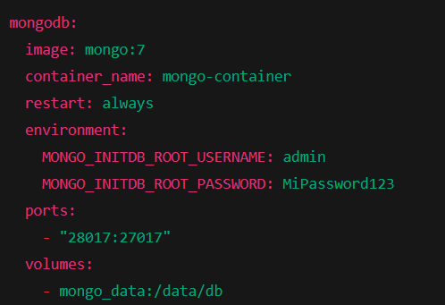

Esto sirve para mantener los datos guardados por si los contenedores se eliminan o se recrean de nuevo:

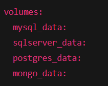

Creamos el contenedor de ubuntu con docker dentro, con los puertos ya preparados para las bases de datos:
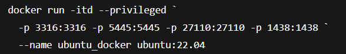

Verificamos que se hayan creado:
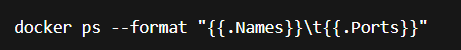

Entramos al contenedor de ubuntu:

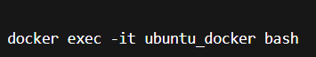

Consulta los servidores para saber que actualizaciones existen:

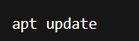

Descarga y agrega repositorios seguros y externos como el de docker:
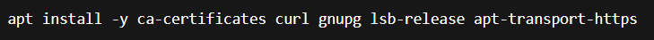

Crea la carpeta donde se guarda la llave GPG que validan los paquetes del sitio oficial:
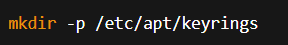

Descarga y guarda la GPG  de docker que ubuntu usa:
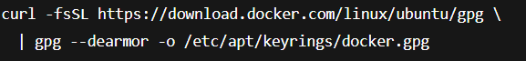

Añade el repositorio de docker al sistema para poder instalarlo desde alli:
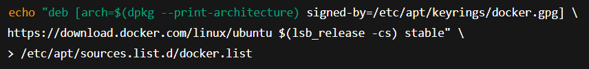

Actualizamos e instalamos docker dentro del contenedor de ubuntu:
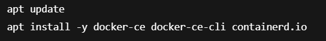

Iniciamos docker dentro del contenedor de ubuntu:
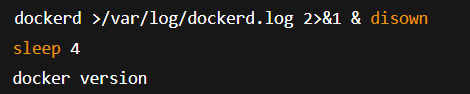

Creamos la red de docker:

Creamos una red interna que se llama redes_bd en docker donde conectaremos todos los contenedores de base de datos:

Crea un contenedor de MySQL 8.0 listo para usar, en la red redes_bd:
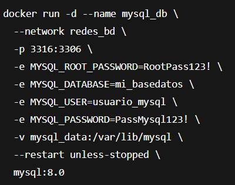

Crea un contenedor con PostgreSQL 15 listo para usar, en la red redes_bd:
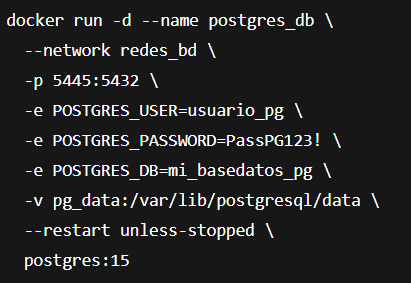

Crea un contenedor con MongoDB version 6 listo para usar, en la red redes_bd:
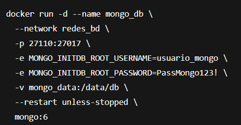

Crea un contenedor con SQL Server 2019 listo para usar, en la red redes_bd:
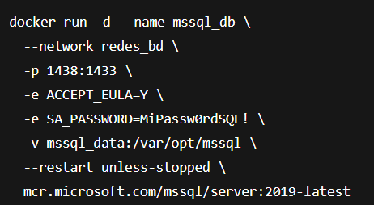

Verificamos que se hayan creado:
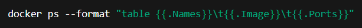

Nos deberia mostrar algo como esto:
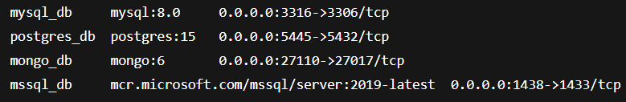
Y ya con esto nos podemos conectar en los 4 motores de base de datos con el host, user y password que le pusimos anteriormente.

Para inicializar el docker:

- Con esto podemos abrir el ubuntu que creamos:

- Con esto podemos mirar si el contenedor de docker esta activo dentro del ubuntu: 

    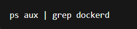

- Con esto podremos levantar el docker interno del ubuntu:
    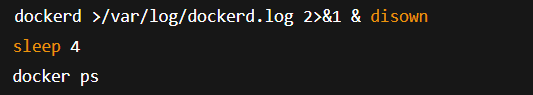

- Y esto nos ayudara a saber si las bases estan activas dentro del ubuntu:
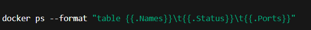

- Con Ctrl + D o exit se cierra el root de ubuntu